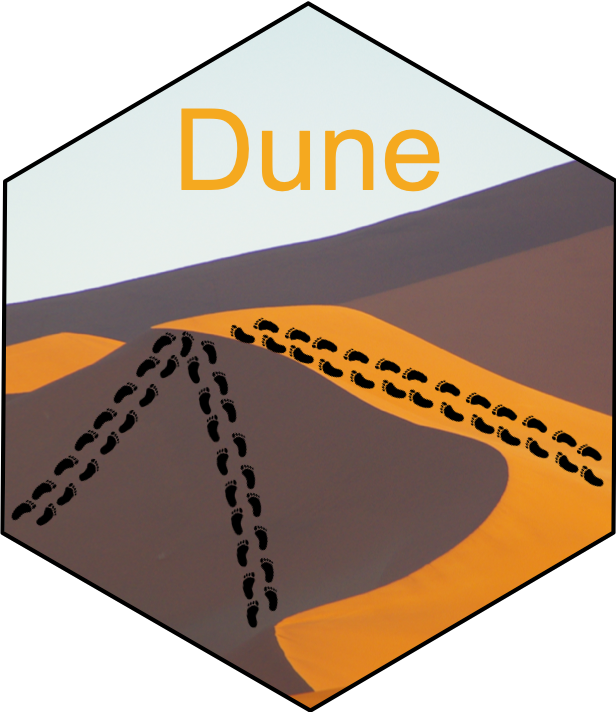

# Dune

<!-- badges: start -->
  [](https://travis-ci.com/HectorRDB/Dune) [](https://codecov.io/gh/HectorRDB/Dune)
<!-- badges: end -->

<p align="center">
  
</p>

## Dune overview

Dune is an R Package that provides a parameter-free method for optimizing the trade-off between the resolutionof the clusters and their replicability across datasets. Dune  method takes as input a set of clustering results on a dataset, and iteratively merges clusters within those clusterings in order to maximize their concordance.  


## Installation

To install the current version of *Dune* , run.

```
if(!requireNamespace("devtools", quietly = TRUE)) {
 install.packages("devtools") 
}
devtools::install_github("HectorRDB/Dune")
```

The installation should only take a few seconds.
The dependencies of the package are listed in the DESCRIPTION file of the package.

## Issues and bug reports

Please use the [github issues](https://github.com/HectorRDB/Dune/issues) to submit issues, bug reports, and comments.

## Usage 

Start with the vignette [online](https://hectorRDB.github.io/Dune/articles/Dune.html).
